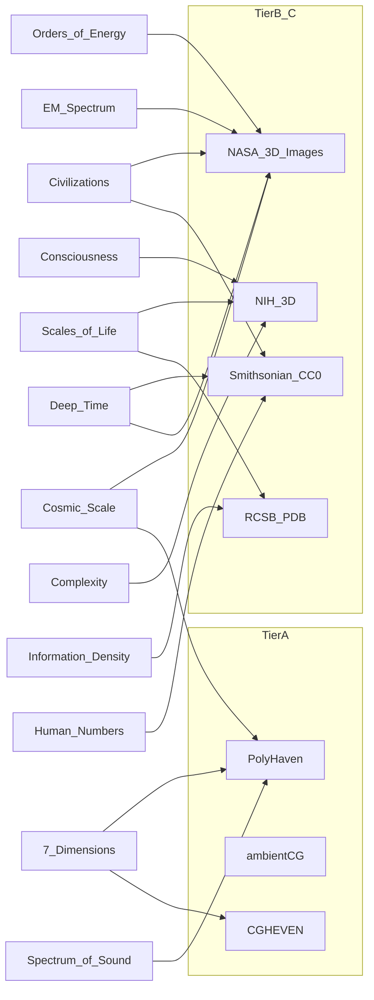

# SCALE — open-source asset sources

Site-wide catalog of **where SCALE pulls cinematic content from** for every environment track.

Cosmic Scale file-level provenance stays in [`public/cosmic/SOURCES.md`](public/cosmic/SOURCES.md). This document is the policy and source map for all sims.

Aligned with [`PRODUCT.md`](PRODUCT.md), [`DESIGN.md`](DESIGN.md), and the landing Veo brief (`../landing page video generation.md`).

---

## Quality bar (binding)

Every imported asset must meet all of the following:

| Rule | Requirement |
|------|-------------|
| **Cinematic continuity** | Photoscanned, artist-authored, or mission-grade assets that can share lighting language across beats (HDRI + PBR). Not one-off mesh dumps. |
| **Web-ready formats** | Prefer **glTF/GLB**, **HDR/EXR**, **KTX2/PNG PBR maps**. Convert FBX/OBJ/Blend offline in Blender before commit. |
| **License-clear** | Prefer **CC0 / public domain / NASA media**. Allow **CC-BY** with attribution logged. Reject unclear or “free for personal use only.” |
| **Stack fit** | Three.js `GLTFLoader` + `RGBELoader` / env maps. Chrome stays B&W. Journey content may be photoreal when the track allows (Cosmic already does). |

### Reject

- Generative AI meshes and scenes
- Kenney-style low-poly game kits (wrong aesthetic for SCALE)
- Neon / cyberpunk asset packs
- Unlicensed Sketchfab dumps (must filter downloadable + CC0 or CC-BY and verify per model)
- Invented procedural planets/bodies when scientific sources exist

### Procedural Three.js — glue only

Procedural geometry is allowed for **camera paths, transitions, and HUD-aligned particles** — not as the hero mesh. Hero content is imported.

---

## Tier A — Universal cinematic foundation (all sims)

| Source | What | Formats | License | Why |
|--------|------|---------|---------|-----|
| [Poly Haven](https://polyhaven.com/) | HDRIs, 8K+ PBR textures, photoreal models | HDR/EXR, PNG maps, glTF | CC0 | Primary lighting + material standard; Blender-grade look in WebGL |
| [ambientCG](https://ambientcg.com/) | Seamless PBR surfaces, HDRIs, some models | PNG maps, HDR | CC0 | Volume materials (metal, stone, ice, fabric) without attribution friction |
| [CGHEVEN](https://cgheven.com/) | VDBs, VFX elements, cinematic models | VDB, flipbooks, FBX/GLB | CC0 | Volumetrics / atmospheric continuity (bake or flipbook for web) |
| [Khronos glTF Sample Assets](https://github.com/KhronosGroup/glTF-Sample-Assets) | Reference animated / PBR glTF | glTF/GLB | Per-asset (many CC0) | Pipeline validation + morph/animation patterns for continuity |

---

## Tier B — Mission / scientific truth

| Source | What | Formats | License | Primary tracks |
|--------|------|---------|---------|----------------|
| [NASA 3D Resources](https://science.nasa.gov/3d-resources/) (+ [GitHub mirror](https://github.com/nasa/NASA-3D-Resources)) | Spacecraft, terrain, nebula models | STL, OBJ, some GLB | [NASA media guidelines](https://www.nasa.gov/nasa-brand-center/images-and-media/) | Cosmic, Civilizations, Energy |
| [NASA Images](https://images-assets.nasa.gov/) | Mission imagery (already used in Cosmic) | JPG/PNG/TIFF | Public domain / NASA | Cosmic |
| [Solar System Scope textures](https://www.solarsystemscope.com/textures/) | Planet / moon albedos (already used) | JPG/PNG | [CC BY 4.0](https://creativecommons.org/licenses/by/4.0/) | Cosmic |
| ESA / Hubble / JWST / [Universe of Learning](https://www.universe-of-learning.org/) | Nebulae, multiwavelength viz, some 3D | Imagery, STL/OBJ | Check per asset | Cosmic, EM Spectrum, Energy |
| USGS / NOAA open data | Earth terrain, climate rasters | GeoTIFF, DEM | Public domain / open | Cosmic (Earth), Deep Time |

---

## Tier C — Life, consciousness, complexity (bioscience)

| Source | What | Formats | License | Primary tracks |
|--------|------|---------|---------|----------------|
| [NIH 3D](https://3d.nih.gov/) | Cells, anatomy, biomolecules | Often GLB, STL, X3D | Per-entry — prefer CC / public domain | Scales of Life, Consciousness, Complexity |
| [RCSB PDB](https://www.rcsb.org/) + [Mol*](https://molstar.org/) glTF export | Atomic structures → GLB | mmCIF → GLB via Mol* | PDB terms + citation | Life, Information, Complexity |
| [EMDB](https://www.ebi.ac.uk/emdb/) | Cryo-EM density maps | Map formats | Open scientific | Life, Complexity |
| [Smithsonian 3D (CC0 filter)](https://3d.si.edu/explore?edan_fq%5B0%5D=media_usage:CC0) | Specimens, artifacts, spacecraft | OBJ, glTF where available | CC0 when filtered | Life, Deep Time, Human Numbers, Civilizations |

---

## Tier D — Human scale / civilization / population

| Source | What | Formats | License | Primary tracks |
|--------|------|---------|---------|----------------|
| [Sketchfab](https://sketchfab.com/) (**downloadable + CC0/CC-BY filter only**) | Specific hero props / landmarks | glTF, FBX | Per-model — verify before commit | Civilizations, Human Numbers, Deep Time |
| Poly Haven models | Photoreal props / architecture pieces | glTF | CC0 | Civilizations, Human Numbers |
| [Renderpeople Free](https://renderpeople.com/free-3d-people/) | Photogrammetry / volumetric **scanned humans** (posed, rigged, animated) | FBX, OBJ, GLB (posed), Blender | Free commercial use per Renderpeople ToU (same as shop) | **7 Dimensions** continuity man; Civilizations / Human Numbers |
| OpenStreetMap / Cesium OSM buildings | City massing (later) | 3D Tiles / geo | [ODbL](https://www.openstreetmap.org/copyright) | Human Numbers, Civilizations |

---

## Tier E — Abstract / dimensional / math cinema (7 Dimensions)

There is no single “7D model pack.” Step off the from-scratch procedural seed with shared lighting + curated hero geometry:

| Source / approach | Role |
|-------------------|------|
| Poly Haven HDRIs + volumetric-friendly textures | Shared void lighting language across 0D→7D |
| Khronos samples with **morph / animation** | Continuity patterns (morph targets, slow transforms) |
| Sketchfab CC0: tesseracts, lattices, wireframe solids (hand-picked, license-verified) | 4D–7D metaphor hero geometry |
| BlenderKit free / [Blend Swap](https://www.blendswap.com/) (CC0/CC-BY only) | Author-grade abstract scenes; bake → GLB |
| CGHEVEN VFX / particle elements | Particle tunnels / singularities matching `design inspiration/` Veo stills |

---

## Track → primary sources

| # | Track | Primary sources |
|---|-------|-----------------|
| 01 | 7 Dimensions | Poly Haven HDRI/PBR + **Cardboard Box 01**; Renderpeople free scanned human (Blender → GLB); CGHEVEN atmospherics; curated CC0 abstract only as glue |
| 02 | Cosmic Scale | Existing NASA + Solar System Scope ([`public/cosmic/SOURCES.md`](public/cosmic/SOURCES.md)); expand with NASA 3D Resources meshes where useful |
| 03 | Levels of Consciousness | NIH 3D (brain/neural), PDB structures |
| 04 | Levels of Civilizations | NASA craft/settlement refs, Smithsonian CC0 tech/architecture, Poly Haven env |
| 05 | Deep Time | Smithsonian fossils/geology CC0, USGS, NASA cosmology stills |
| 06 | Orders of Energy | NASA mission viz, CGHEVEN VFX (controlled mono treatment) |
| 07 | Information Density | PDB / Mol* exports, abstract Poly Haven materials |
| 08 | Scales of Life | NIH 3D, PDB, EMDB, Smithsonian specimens |
| 09 | Spectrum of Sound | Poly Haven materials + custom wave geometry (sourced waveforms if available) |
| 10 | Electromagnetic Spectrum | NASA multiwavelength imagery (Hubble / JWST / Chandra sets) |
| 11 | Human Numbers | Smithsonian / OSM massing / Poly Haven urban props |
| 12 | Layers of Complexity | NIH + PDB ladder (particle → molecule → cell → organism via real structures) |



---

## Import workflow

1. **Select** from a Tier A–E source that maps to the track; confirm license.
2. **Download** preferred web format (GLB / HDR / PBR maps). If only FBX/OBJ/Blend/STL — open in Blender.
3. **Optimize in Blender**
   - Decimate / remesh to a web budget (aim: hero under ~1–2 MB GLB unless justified)
   - Apply scale, freeze transforms, clean materials toward glTF PBR
   - Bake complex shaders / volumetrics to textures or flipbooks when needed for Three.js
4. **Export** glTF 2.0 binary (`.glb`); optional Draco or meshopt compression for large meshes.
5. **Place** under `public/<track>/` (e.g. `public/dimensions/`, `public/cosmic/`).
6. **Log provenance** — add a row to the track’s `SOURCES.md` (create one if missing). Cosmic continues to use [`public/cosmic/SOURCES.md`](public/cosmic/SOURCES.md).
7. **Credit in UI / catalog** when license requires attribution (CC-BY, NASA credit lines, PDB citation).

### Runtime (Three.js)

- Meshes: `GLTFLoader` (+ `DRACOLoader` / `MeshoptDecoder` when compressed)
- Lighting: `RGBELoader` / `EXRLoader` → `scene.environment` / background as appropriate
- Keep HUD and chrome monochrome per `DESIGN.md`

---

## Attribution template

Use this table shape in each track’s local `SOURCES.md` (mirror Cosmic):

```markdown
| Asset | Source | License | Notes |
|-------|--------|---------|-------|
| `path/to/file.glb` | [Publisher / URL](https://…) | CC0 / CC BY 4.0 / NASA / … | Optional credit line |
```

**CC-BY example:** credit the author and link as required by the license.

**NASA:** follow [NASA Images and Media Usage Guidelines](https://www.nasa.gov/nasa-brand-center/images-and-media/); do not imply NASA endorsement.

**PDB / NIH:** cite structure IDs and entry licenses as marked on the source page.

---

## Related docs

- Cosmic provenance: [`public/cosmic/SOURCES.md`](public/cosmic/SOURCES.md)
- Product constraints: [`PRODUCT.md`](PRODUCT.md)
- Visual system: [`DESIGN.md`](DESIGN.md)
- Track catalog: [`src/landing/tracks.ts`](src/landing/tracks.ts)
